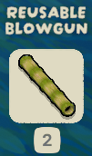
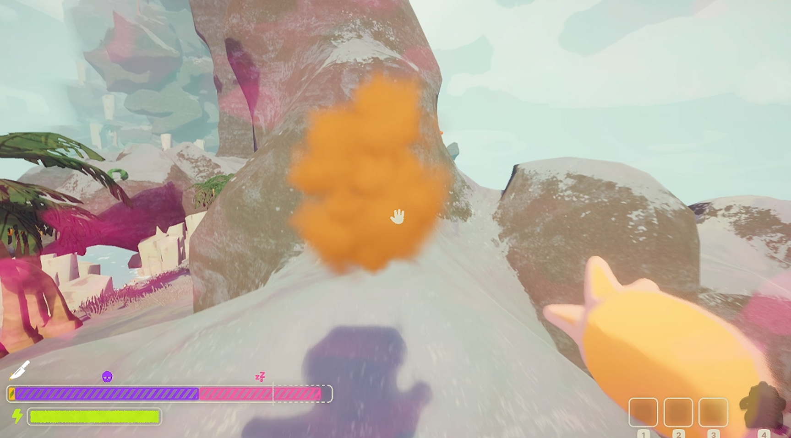
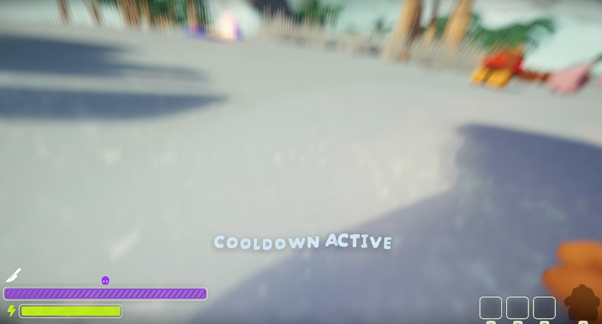
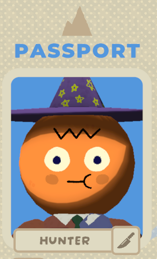
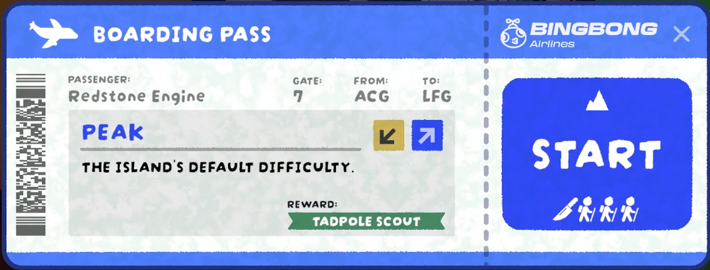

# Hunter Mod

**All Clients must have the Mod Installed!**

Want to try a new gamemode in PEAK? Try the Hunter mod where you can choose to be on the Hunter or Climber team as you race up the mountain! Similar to a Minecraft Manhunt!

#### See the Hunter Mod in Action! (Click to Watch)

## The Climber Role

The Goal:
* Make it to the top, regular old PEAK style!

Abilities:
* One random Climber will receive a Blowgun that can be reused every 7 minutes! (Every 1 Minute in the lobby)

* Fall Damage has been halved!

Extra Info:
* Only Climbers can activate and use Campfires, Statues, and Scout Effigies
* Be careful of dying as the Curse Respawn amount is tripled!

## The Hunter Role

The Goal:
* Stop the Climbers from reaching the top at all costs!

Abilities:
* The Reach Ability is now an explosive Attack which causes damage with knockback to anyone within this area of effect! Be careful though as it costs 50% of your stamina in drowsiness and you could pass out!

* You will also naturally regen extra stamina to be able to catch up with the Climbers!

* Upon death, you will respawn at the last campfire!
* You will receive a forth of all Fall Damage!

Extra Info:
* Upon initial spawn and after each campfire, a cooldown will be applied and you will teleport to the latest campfire!

* Items will not be lost except upon death.

## Game Setup

In the passport, you can change which role you are: Hunter or Climber.

You should see a corresponding amount of Knives and Climbers in the Boarding Pass as there are in the Lobby!

You can also see which team you're on based on the icon above the Stamina Bar.

The host of the game can set specific parameters in the settings, in the Hunter Tab.
These settings are the same as the ones in the Mod Config.

For added spice, you can set the game to start with 1 Random Hunter by enabling "Pick Random Hunter"!
You can also enable "Zombie Mode" where once a Climber dies, they join the Hunter Team!

## Zombie Mode

Here's some extra info and features of Zombie Mode!

* Zombies will share the extra stamina so if Hunter's Extra Stamina is set to 0.5 and you get 2 Zombies, the Extra Stamina for each will be set to 0.25 so the Zombies don't become too overpowered too quickly!
* If you set the Hunter Attack Type to Curse, the Curse Attribute will now get reset upon a Climber dying and respawning as a Hunter!
* It is recommended turning on Team Colors to change the Hunters to Red and Climbers to Blue to tell who to run away from!

## Last Notes

I made this mod for the fun of it and for a YouTube video! (Thanks for checking it out if you have!)
This is my first ever mod, so if there's anything broken or any suggested changes, let me know here -> [Discord Post](https://discord.com/channels/1363179626435707082/1446981780648366150)
Changes and Fixes may be slow as my current life is a bit busy and as I work on the next YouTube video for BloopTank!
Thanks for checking out the mod and reading! - RedEngDev
